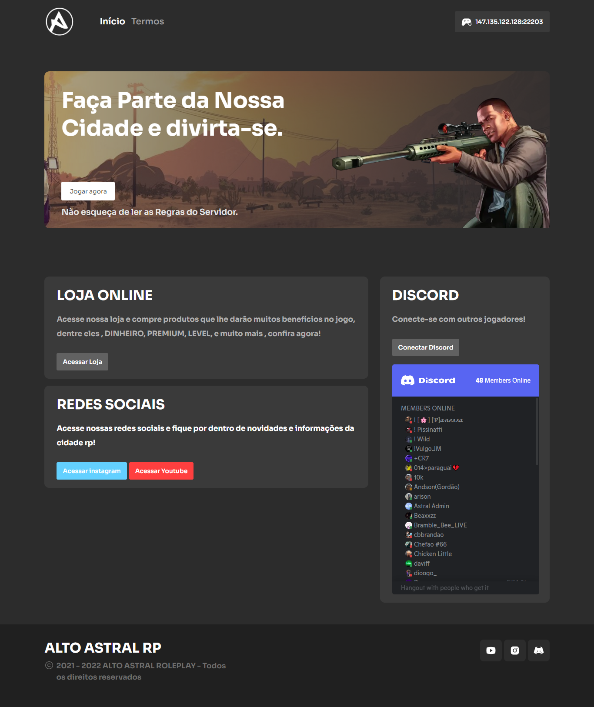

# Projeto Alto Astral Website

## 💻 _altoastralwebsite_

Website responsável por apresentar informações sobre a comunidade Alto Astral voltada para a plataforma do MTA.

## 💻 Projeto desenvolvido

<a href="https://altoastralrp.vercel.app" target="_blank">Acesse o projeto</a>

## 💡 Info

O projeto contém uma interface moderna e responsiva para apresentar informações sobre a comunidade Alto Astral !

## 🔨 Possiveis atualizações

-   Implementação de login via Discord.
-   Implementação da loja para compra de produtos/serviços internos.

## 💻 Tecnologias/Pacotes utilizados

**Frontend**

-   ReactJS
-   TypeScript
-   NextJs
-   CSSModules
-   PhosphorReact

## 👨‍💻 Autor

Gabriel Dias Catarin, desenvolvedor web | Bauru, São Paulo

[ LinkedIn](https://www.linkedin.com/in/gabriel-dias-260857207/)
&nbsp;
